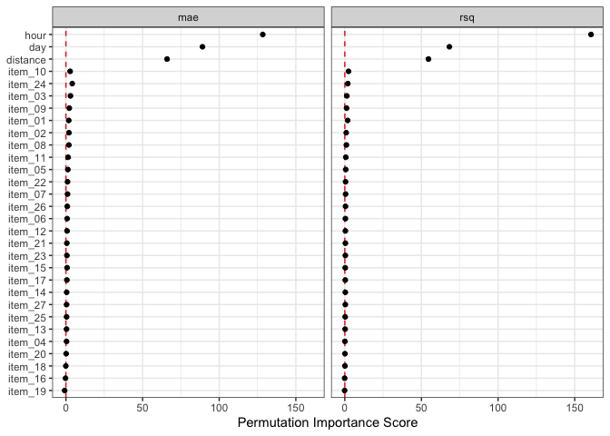

<!-- README.md is generated from README.Rmd. Please edit that file -->

# important

<!-- badges: start -->

[](https://github.com/tidymodels/important/actions/workflows/R-CMD-check.yaml)
[](https://app.codecov.io/gh/tidymodels/important)
<!-- badges: end -->

The important package has a succinct interface for obtaining estimates
of predictor importance with tidymodels objects. A few of the main
features:

- Any performance metrics from the yardstick package can be used.
- Importance can be calculated for either the original columns or at the
  level of any derived model terms created during feature engineering.
- The computations that loop across permutation iterations and
  predictors columns are easily parallelized.
- The results are returned in a tidy format.

There are also recipe steps for supervised feature selection:

- `step_predictors_retain()` can filter the predictors using a single
  conditional statement (e.g., absolute correlation with the outcome \>
  0.75, etc).
- `step_predictors_best()` can retain the most important predictors for
  the outcome using a single scoring function.
- `step_predictors_desirability()` retains the most important predictors
  for the outcome using multiple scoring functions, blended using
  desirability functions.

The latter two steps can be tuned over the proportion of predictors to
be retained.

## Installation

You can install the development version of important from
[GitHub](https://github.com/) with:

``` r
install.packages("devtools")
# or
pak::pak("tidymodels/important")
```

## Do we really need another package that computes variable importances?

The main reason for making important is censored regression models.
tidymodels released tools for fitting and qualifying models that have
censored outcomes. This included some dynamic performance metrics that
were evaluated at different time points. This was a substantial change
for us, and it would have been even more challenging to add to other
packages.

## Variable importance Example

Let’s look at an analysis that models [food delivery
times](https://aml4td.org/chapters/whole-game.html#sec-delivery-times).
The outcome is the time between an order being placed and the delivery
(all data are complete - there is no censoring). We model this in terms
of the order day/time, the distance to the restaurant, and which items
are contained in the order. Exploratory data analysis shows several
nonlinear trends in the data and some interactions between these trends.

We’ll load the tidymodels and important packages to get started.

The data are split into training, validation, and testing sets.

``` r
data(deliveries, package = "modeldata")

set.seed(991)
delivery_split <- initial_validation_split(deliveries, prop = c(0.6, 0.2), strata = time_to_delivery)
delivery_train <- training(delivery_split)
```

The model uses a recipe with spline terms for the hour and distances.
The nonlinear trend over the time of order changes on the day, so we
added interactions between these two sets of terms. Finally, a simple
linear regression model is used for estimation:

``` r
delivery_rec <- 
  recipe(time_to_delivery ~ ., data = delivery_train) |> 
  step_dummy(all_factor_predictors()) |> 
  step_zv(all_predictors()) |> 
  step_spline_natural(hour, distance, deg_free = 10) |> 
  step_interact(~ starts_with("hour_"):starts_with("day_"))

lm_wflow <- workflow(delivery_rec, linear_reg())
lm_fit <- fit(lm_wflow, delivery_train)
```

First, let’s capture the effect of the individual model terms. These
terms are from the derived features in the models, such as dummy
variables, spline terms, interaction columns, etc.

``` r
set.seed(382)
lm_deriv_imp <- 
  importance_perm(
    lm_fit,
    data = delivery_train,
    metrics = metric_set(mae, rsq),
    times = 50,
    type = "derived"
  )
lm_deriv_imp
#> # A tibble: 226 × 6
#>    .metric predictor             n  mean std_err importance
#>    <chr>   <chr>             <int> <dbl>   <dbl>      <dbl>
#>  1 rsq     distance_10          50 0.528 0.00655       80.5
#>  2 mae     day_Sat              50 1.09  0.0150        72.2
#>  3 mae     distance_10          50 2.20  0.0323        68.2
#>  4 mae     day_Fri              50 0.877 0.0140        62.7
#>  5 mae     day_Thu              50 0.638 0.0130        49.0
#>  6 mae     distance_09          50 0.740 0.0156        47.3
#>  7 mae     hour_08              50 0.520 0.0136        38.3
#>  8 rsq     day_Sat              50 0.118 0.00327       36.2
#>  9 rsq     hour_06_x_day_Sat    50 0.146 0.00410       35.7
#> 10 mae     hour_08_x_day_Sat    50 0.604 0.0173        34.9
#> # ℹ 216 more rows
```

Using mean absolute error as the metric of interest, the top 5 features
are:

``` r
lm_deriv_imp |> 
    filter(.metric == "mae") |> 
    slice_max(importance, n = 5)
#> # A tibble: 5 × 6
#>   .metric predictor       n  mean std_err importance
#>   <chr>   <chr>       <int> <dbl>   <dbl>      <dbl>
#> 1 mae     day_Sat        50 1.09   0.0150       72.2
#> 2 mae     distance_10    50 2.20   0.0323       68.2
#> 3 mae     day_Fri        50 0.877  0.0140       62.7
#> 4 mae     day_Thu        50 0.638  0.0130       49.0
#> 5 mae     distance_09    50 0.740  0.0156       47.3
```

Two notes:

- The importance scores are the ratio of the mean change in performance
  and the associated standard error. The mean value is always increasing
  with importance, no matter which direction is preferred for the
  specific metric(s).

- We can run these in parallel by loading the future package and
  specifying a parallel backend using the `plan()` function.

There is a plot method that can help visualize the results:

``` r
autoplot(lm_deriv_imp, top = 50)
```


Since there are spline terms and interactions for the hour column, we
might not care about the importance of a term such as `hour_06` (the
sixth spline feature). In aggregate, we might want to know the effect of
the original predictor columns. The `type` option is used for this
purpose:

``` r
set.seed(382)
lm_orig_imp <- 
    importance_perm(
        lm_fit,
        data = delivery_train,
        metrics = metric_set(mae, rsq),
        times = 50,
        type = "original"
    )

# Top five: 
lm_orig_imp |> 
    filter(.metric == "mae") |> 
    slice_max(importance, n = 5)
#> # A tibble: 5 × 6
#>   .metric predictor     n   mean std_err importance
#>   <chr>   <chr>     <int>  <dbl>   <dbl>      <dbl>
#> 1 mae     hour         50 4.10    0.0320     128.  
#> 2 mae     day          50 1.91    0.0214      89.1 
#> 3 mae     distance     50 1.46    0.0222      66.0 
#> 4 mae     item_24      50 0.0489  0.0119       4.11
#> 5 mae     item_03      50 0.0337  0.0114       2.95
```

``` r
autoplot(lm_orig_imp)
```



## Supervised Feature Selection Example

Using the same dataset, let’s illustrate the most common tool for
filtering predictors: using random forest importance scores.

important can use any of the “scoring functions” from the
[filtro](https://filtro.tidymodels.org/) package. You can supply one,
and the proportion of the predictors to retain:

``` r
set.seed(491)
selection_rec <- 
    recipe(time_to_delivery ~ ., data = delivery_train) |> 
    step_predictor_best(all_predictors(), score = "imp_rf", prop_terms = 1/4) |> 
    step_dummy(all_factor_predictors()) |> 
    step_zv(all_predictors()) |> 
    step_spline_natural(any_of(c("hour", "distance")), deg_free = 10) |> 
    step_interact(~ starts_with("hour_"):starts_with("day_")) |> 
    prep()
selection_rec
#> 
#> ── Recipe ──────────────────────────────────────────────────────────────────────
#> 
#> ── Inputs
#> Number of variables by role
#> outcome:    1
#> predictor: 30
#> 
#> ── Training information
#> Training data contained 6004 data points and no incomplete rows.
#> 
#> ── Operations
#> • Feature selection via `imp_rf` on: item_03 item_04, ... | Trained
#> • Dummy variables from: day | Trained
#> • Zero variance filter removed: <none> | Trained
#> • Natural spline expansion: hour distance | Trained
#> • Interactions with: hour_01:day_Tue hour_01:day_Wed, ... | Trained
```

A list of possible scores is contained in the help page for the recipe
steps.

Note that we changed selectors in `step_spline_natural()` to use
`any_of()` instead of specific names. Any step downstream of any
filtering steps should be generalized so that there is no failure if the
columns were removed. Using `any_of()` selects these two columns *if
they still remain in the data*.

Which were removed?

``` r
selection_res <- 
    tidy(selection_rec, number = 1) |> 
    arrange(desc(score))

selection_res
#> # A tibble: 30 × 4
#>    terms    removed   score id                  
#>    <chr>    <lgl>     <dbl> <chr>               
#>  1 hour     FALSE   48.5    predictor_best_rCIMa
#>  2 day      FALSE   13.5    predictor_best_rCIMa
#>  3 distance FALSE   13.3    predictor_best_rCIMa
#>  4 item_10  FALSE    1.18   predictor_best_rCIMa
#>  5 item_01  FALSE    1.01   predictor_best_rCIMa
#>  6 item_24  FALSE    0.160  predictor_best_rCIMa
#>  7 item_02  FALSE    0.0676 predictor_best_rCIMa
#>  8 item_26  TRUE     0.0666 predictor_best_rCIMa
#>  9 item_03  TRUE     0.0593 predictor_best_rCIMa
#> 10 item_22  TRUE     0.0565 predictor_best_rCIMa
#> # ℹ 20 more rows

mean(selection_res$removed)
#> [1] 0.7666667
```

This example shows the basic usage of the recipe. In practice, we would
probably do things differently:

- This step would be included in a workflow so that it is coupled to a
  model.
- It would be a good idea to optimize how much selection is done by
  setting `prop_terms = tune()` in the step and using one of the tuning
  functions to find a good proportion.

*Inappropriate* use of these selection steps occurs when it is used
before the data are split or outside of a resampling step.

## Code of Conduct

Please note that the important project is released with a [Contributor
Code of
Conduct](https://contributor-covenant.org/version/2/1/CODE_OF_CONDUCT.html).
By contributing to this project, you agree to abide by its terms.
